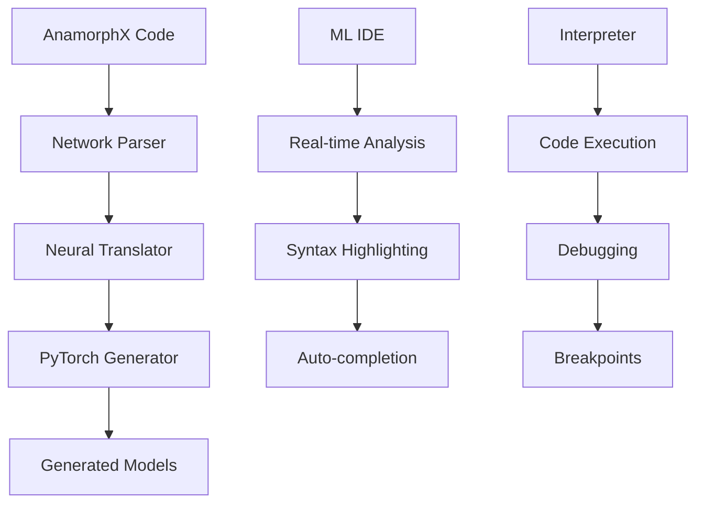

# 🧠 AnamorphX - Neural Programming Language & ML IDE

[](https://opensource.org/licenses/MIT)
[](https://www.python.org/downloads/)
[](https://github.com/quantros/anamorphX)
[](src/neural_backend/)

> **AnamorphX** - A revolutionary neural programming language with an integrated ML IDE, featuring automatic PyTorch code generation and real-time neural network analysis.

## 🌟 Key Features

### 🧠 Neural Programming Language
- `network` - Define neural network architectures
- `neuron` - Create individual layers with parameters
- `activation` - Specify activation functions (relu, sigmoid, softmax, etc.)
- `optimizer` - Configure training optimizers (adam, sgd, etc.)

### ⚡ Neural Network Backend
- **Automatic PyTorch Generation**: Convert AnamorphX networks to PyTorch code
- **Real-time Analysis**: Analyze network architectures with recommendations
- **Training Scripts**: Auto-generate training and inference scripts
- **Validation**: Built-in validation and optimization suggestions

### 🔧 Integrated ML IDE
- **Syntax Highlighting**: Full AnamorphX syntax support
- **Real-time ML Analysis**: Code analysis with PyTorch models
- **Debugging**: Breakpoints and step-by-step execution
- **Auto-completion**: ML-powered code suggestions
- **Neural Visualization**: Interactive network architecture display

### 🏗️ Enterprise Ready
- **Modular Architecture**: Clean separation of concerns
- **Plugin System**: Extensible with custom components
- **Performance Monitoring**: Built-in metrics and profiling
- **Documentation**: Auto-generated docs for every model

## 📝 Recent Updates

- Added the **anamorph_core** package to expose lexer, parser and interpreter
  classes as a single library
- Introduced a minimal grammar module for validating parser rules
- Added a dataset loader helper used by training scripts
- Created example web server programs in `examples/web_server.amph`

## 🚀 Quick Start

### Example Code

```anamorphx
// Define a Convolutional Neural Network
network ImageClassifier {
    neuron ConvLayer1 {
        activation: relu
        filters: 32
        kernel_size: 3
        padding: 1
    }
    
    neuron PoolLayer1 {
        pool_size: 2
        stride: 2
    }
    
    neuron DenseLayer {
        activation: relu
        units: 128
        dropout: 0.5
    }
    
    neuron OutputLayer {
        activation: softmax
        units: 10
    }
    
    optimizer: adam
    learning_rate: 0.001
    loss: categorical_crossentropy
    batch_size: 64
    epochs: 200
}
```

### Generated PyTorch Code

```python
import torch
import torch.nn as nn
import torch.nn.functional as F

class ImageClassifier(nn.Module):
    def __init__(self, input_size=None):
        super(ImageClassifier, self).__init__()
        
        self.convlayer1 = nn.Conv2d(in_channels, 32, kernel_size=3, padding=1)
        self.poollayer1 = nn.MaxPool2d(kernel_size=2, stride=2)
        self.denselayer = nn.Linear(input_size, 128)
        self.outputlayer = nn.Linear(128, 10)
        self.dropout_denselayer = nn.Dropout(0.5)
    
    def forward(self, x):
        x = F.relu(self.convlayer1(x))
        x = self.poollayer1(x)
        x = F.relu(self.denselayer(x))
        x = self.dropout_denselayer(x)
        x = F.softmax(self.outputlayer(x), dim=1)
        return x
```

### Installation

```bash
# Clone the repository
git clone https://github.com/quantros/anamorphX.git
cd anamorphX

# Create virtual environment
python -m venv venv
source venv/bin/activate  # Linux/Mac
# or
venv\Scripts\activate     # Windows

# Install dependencies
pip install -r requirements.txt

# Launch the ML IDE
python run_full_ml_interpreter_ide.py
```

## 📁 Project Structure

```
anamorphX/
├── 🎯 full_ml_interpreter_ide.py     # Main ML IDE (3000+ lines)
├── 🚀 run_full_ml_interpreter_ide.py # IDE launcher
├── 📚 src/                           # Source code
│   ├── syntax/                       # Language syntax & AST
│   ├── interpreter/                  # Code interpreter
│   ├── neural_backend/               # Neural Network Backend ✨
│   │   ├── network_parser.py         # Parse network blocks
│   │   ├── pytorch_generator.py      # Generate PyTorch code
│   │   └── neural_translator.py      # Full translation pipeline
│   └── tools/                        # Development tools
├── 🧪 demo/                          # Demonstrations
│   ├── neural_backend_demo.py        # Neural Backend demo
│   └── dev_tools_demo.py             # Development tools demo
├── 📋 examples/                      # Code examples
├── 📁 archive/                       # Project history
└── 🔧 tools/                         # Scripts and utilities
```

## 🏗️ Architecture



### System Components

- **Network Parser**: Extracts neural network structures from AnamorphX code
- **PyTorch Generator**: Automatically generates PyTorch models and training scripts
- **ML IDE**: Full-featured development environment with real-time analysis
- **Interpreter**: Executes AnamorphX code with debugging support
- **Neural Visualization**: Interactive display of network architectures

## 📊 Development Progress

| Component | Completion | Status |
|-----------|------------|--------|
| 🧠 Neural Backend | 100% | ✅ Complete |
| 🎯 ML IDE Integration | 100% | ✅ Complete |
| 🔤 Language Syntax | 95% | ✅ Nearly Complete |
| ⚙️ Code Interpreter | 85% | 🔄 In Progress |
| 🧪 Testing Framework | 80% | 🔄 In Progress |
| 📚 Documentation | 75% | 🔄 In Progress |
| 🌐 Web Interface | 30% | ⏳ Planned |

**Overall Progress: 85% Complete** 🎯

### Completed Stages:
1. ✅ **Stage 1:** Basic project structure (10%)
2. ✅ **Stage 2:** Syntax and AST (20%)
3. ✅ **Stage 3:** Interpreter foundation (30%)
4. ✅ **Stage 4:** ML code analysis (40%)
5. ✅ **Stage 5:** Interpreter-IDE integration (50%)
6. ✅ **Stage 6:** Neural Network Backend (60%)
7. ✅ **Stage 7:** Advanced Features & Optimization (70%)
8. ✅ **Stage 8:** Extended Commands & Architectures (85%)
9. 🔄 **Stage 9:** Complete Command Set & Visual Designer (In Progress)

### Current Stage: Complete Command Set & Visual Designer
- **Extended Commands**: 25+ new commands implemented (bind, cluster, evolve, etc.)
- **Transformer Support**: Full implementation with positional encoding
- **ResNet Architecture**: Skip connections and residual blocks
- **Security System**: Multi-level data protection and masking
- **ML Validation**: Model validation, optimization, and visualization

## 🔧 IDE Features

### Neural Backend Integration
- **🏗️ Generate PyTorch** - Convert AnamorphX networks to PyTorch (Ctrl+Shift+G)
- **🧠 Neural Analysis** - Analyze network architectures (Ctrl+Shift+N)
- **📊 Real-time Validation** - Instant feedback on network definitions
- **💡 Smart Suggestions** - ML-powered recommendations

### Code Execution & Debugging
- **▶️ Run Code** - Execute AnamorphX programs (F5)
- **🐛 Debug Mode** - Step-by-step debugging with breakpoints (F9)
- **🧠 ML Debug** - Debug with neural network analysis (Ctrl+Shift+D)
- **📊 Performance Profiling** - Real-time execution metrics

### Advanced Features
- **🔍 Semantic Search** - Find code patterns and structures
- **📝 Auto-completion** - Context-aware code suggestions
- **🎨 Syntax Highlighting** - Full AnamorphX language support
- **📊 Visual Debugging** - Interactive execution flow display

## 🧠 Neural Network Examples

### Transformer Architecture

```anamorphx
network TransformerModel {
    neuron MultiHeadAttention {
        heads: 8
        d_model: 512
        dropout: 0.1
    }
    
    neuron FeedForward {
        d_ff: 2048
        activation: relu
        dropout: 0.1
    }
    
    neuron PositionalEncoding {
        max_len: 5000
        d_model: 512
    }
    
    layers: 6
    optimizer: adam
    learning_rate: 0.0001
    warmup_steps: 4000
}
```

### Convolutional Neural Network

```anamorphx
network CNNClassifier {
    neuron Conv2D_1 {
        filters: 64
        kernel_size: 3
        activation: relu
        padding: same
    }
    
    neuron BatchNorm_1 {
        momentum: 0.99
    }
    
    neuron MaxPool_1 {
        pool_size: 2
        stride: 2
    }
    
    neuron Conv2D_2 {
        filters: 128
        kernel_size: 3
        activation: relu
        padding: same
    }
    
    neuron GlobalAvgPool {
        keepdims: false
    }
    
    neuron Dense_Output {
        units: 10
        activation: softmax
    }
    
    optimizer: adamw
    learning_rate: 0.001
    weight_decay: 0.01
    loss: categorical_crossentropy
}
```

## 🚀 Use Cases

### 🎓 Education
- **Learning Neural Networks**: Visual programming approach
- **Research Prototyping**: Rapid architecture experimentation
- **Academic Projects**: Clean, readable neural network definitions

### 🏢 Enterprise
- **Model Development**: Streamlined ML pipeline creation
- **Team Collaboration**: Standardized neural network descriptions
- **Production Deployment**: Automatic PyTorch code generation

### 🔬 Research
- **Architecture Search**: Easy experimentation with different designs
- **Ablation Studies**: Systematic component testing
- **Reproducibility**: Clear, version-controlled model definitions

## 🤝 Contributing

We welcome contributions! Please see our [Contributing Guide](CONTRIBUTING.md) for details.

### Development Setup

```bash
# Clone the repository
git clone https://github.com/quantros/anamorphX.git
cd anamorphX

# Install development dependencies
pip install -r requirements-dev.txt

# Run tests
python -m pytest tests/

# Run the demo
python demo/neural_backend_demo.py
```

## 📄 License

This project is licensed under the MIT License - see the [LICENSE](LICENSE) file for details.

## 🙏 Acknowledgments

- **PyTorch Team** - For the excellent deep learning framework
- **Tkinter Community** - For GUI development support
- **Open Source Community** - For inspiration and best practices

## 📞 Contact

- **GitHub**: [quantros/anamorphX](https://github.com/quantros/anamorphX)
- **Issues**: [Report bugs and feature requests](https://github.com/quantros/anamorphX/issues)
- **Discussions**: [Join the community](https://github.com/quantros/anamorphX/discussions)

---

**AnamorphX** - Transforming the way we think about neural network programming. 🧠✨


program         ::= statement*
statement       ::= node_decl | synap_decl | action | control_flow
node_decl       ::= "neuro" IDENTIFIER
synap_decl      ::= "synap" IDENTIFIER "->" IDENTIFIER
action          ::= COMMAND [arguments]
arguments       ::= "[" arg_list "]"
arg_list        ::= arg ("," arg)*
arg             ::= IDENTIFIER ":" value
value           ::= STRING | NUMBER | IDENTIFIER | boolean
control_flow    ::= "if" condition "then" statement* ["else" statement*] "end"
condition       ::= expression
expression      ::= operand (LOGIC_OP operand)*
operand         ::= IDENTIFIER | STRING | NUMBER | boolean
COMMAND         ::= one of the 80 keywords
IDENTIFIER      ::= /[a-zA-Z_][a-zA-Z0-9_]*/
STRING          ::= /"([^"\\]|\\.)*"/
NUMBER          ::= /-?\d+(\.\d+)?/
boolean         ::= "true" | "false"
LOGIC_OP        ::= "and" | "or" | "not"
 


 Расширенная EBNF-грамматика для Anamorph

program         ::= statement*

statement       ::= node_decl
                  | synap_decl
                  | action_stmt
                  | control_flow
                  | loop_stmt
                  | func_decl
                  | func_call
                  | comment

node_decl       ::= "neuro" IDENTIFIER newline

synap_decl      ::= "synap" IDENTIFIER "->" IDENTIFIER newline

action_stmt     ::= COMMAND [arguments] newline

arguments       ::= "[" arg_list "]"

arg_list        ::= arg ("," arg)*

arg             ::= IDENTIFIER ":" value

value           ::= STRING
                  | NUMBER
                  | IDENTIFIER
                  | boolean

control_flow    ::= "if" condition "then" newline
                     statement*
                   ["else" newline
                     statement*]
                   "end" newline

loop_stmt       ::= "loop" IDENTIFIER "from" NUMBER "to" NUMBER newline
                     statement*
                   "end" newline

func_decl       ::= "func" IDENTIFIER "(" [param_list] ")" newline
                     statement*
                   "end" newline

param_list      ::= IDENTIFIER ("," IDENTIFIER)*

func_call       ::= IDENTIFIER "(" [arg_call_list] ")" newline

arg_call_list   ::= value ("," value)*

condition       ::= expression

expression      ::= operand (LOGIC_OP operand)*

operand         ::= IDENTIFIER
                  | STRING
                  | NUMBER
                  | boolean
                  | "(" expression ")"

COMMAND         ::= "neuro" | "synap" | "pulse" | "resonate" | "drift" | "bind" | "echo"
                  | "forge" | "prune" | "filter" | "guard" | "mask" | "scramble" | "trace"
                  | "quanta" | "phase" | "sync" | "async" | "fold" | "unfold" | "pulseX"
                  | "reflect" | "absorb" | "diffuse" | "cluster" | "expand" | "contract"
                  | "encode" | "decode" | "merge" | "split" | "loop" | "halt" | "yield"
                  | "spawn" | "tag" | "query" | "response" | "encrypt" | "decrypt"
                  | "checkpoint" | "rollback" | "pulseIf" | "wait" | "time" | "jump"
                  | "stack" | "pop" | "push" | "flag" | "clearFlag" | "toggle" | "listen"
                  | "broadcast" | "filterIn" | "filterOut" | "auth" | "audit" | "throttle"
                  | "ban" | "whitelist" | "blacklist" | "morph" | "evolve" | "sense"
                  | "act" | "log" | "alert" | "reset" | "pattern" | "train" | "infer"
                  | "scaleUp" | "scaleDown" | "backup" | "restore" | "snapshot" | "migrate"
                  | "notify" | "validate"

IDENTIFIER      ::= /[a-zA-Z_][a-zA-Z0-9_]*/

STRING          ::= /"([^"\\]|\\.)*"/

NUMBER          ::= /-?\d+(\.\d+)?/

boolean         ::= "true" | "false"

LOGIC_OP        ::= "and" | "or" | "not"

comment         ::= "#" /[^\n]*/ newline

newline         ::= "\n" | "\r\n"


statement — любая инструкция, в том числе объявления узлов (neuro), связей (synap), действия, условия, циклы, функции, вызовы функций и комментарии.

Функции (func) — позволяют инкапсулировать повторяющуюся логику с параметрами.

Циклы (loop) — работают по счётчику от X до Y.

Условные конструкции (if ... then ... else ... end) с вложенностью.

Команды — в виде ключевых слов с необязательными аргументами в квадратных скобках.

Аргументы — ключ-значение, где значение может быть строкой, числом, идентификатором или boolean.

Комментарии — строки начинаются с #.


