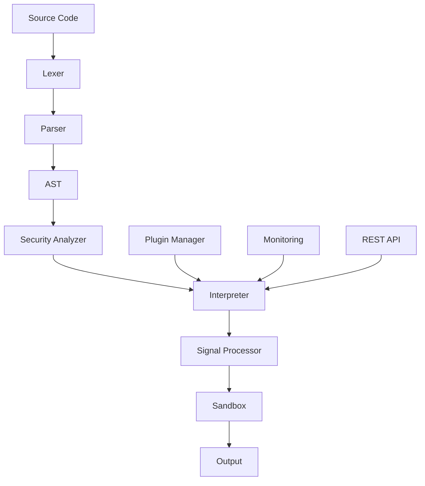

# 🧠 Anamorph - Neural Programming Language

[](https://opensource.org/licenses/MIT)
[](https://www.python.org/downloads/)
[](https://github.com/quantros/anamorphX)
[](docs/enhanced_architecture.md)

> **Anamorph** - уникальный язык программирования с нейронными метафорами, предназначенный для создания безопасных корпоративных веб-серверов с встроенной защитой от XSS, SQL-инъекций и DDoS-атак.

## 🌟 Ключевые особенности

### 🧠 Нейронные метафоры
- `neuro` - определение нейронов (функций)
- `synap` - создание синапсов (переменных) 
- `pulse` - отправка импульсов (сигналов)
- `resonate` - резонанс (циклы и события)

### ⚡ Уникальная система сигналов
- **4 типа сигналов**: синхронные, асинхронные, приоритетные, потоковые
- **Полный жизненный цикл**: создание → валидация → маршрутизация → обработка
- **Встроенная безопасность**: шифрование, контроль доступа, аудит
- **Высокая производительность**: очереди, балансировка, мониторинг

### 🔒 Встроенная безопасность
- **Автоматическая защита** от веб-уязвимостей
- **Статический анализ** кода на этапе компиляции
- **Docker-песочница** с изоляцией ресурсов
- **Криптографические примитивы** встроены в язык

### 📊 Enterprise-готовность
- **Prometheus метрики** и мониторинг
- **Структурированное логирование**
- **Health checks** и диагностика
- **REST API** для управления
- **Система плагинов** для расширений

## 🚀 Быстрый старт

### Пример кода

```anamorph
neuro webServer {
    synap port = 8080;
    synap routes = {};
    
    // Настройка маршрутов
    routes["/api/users"] = handleUsers;
    routes["/api/data"] = handleData;
    
    // Запуск сервера с защитой
    resonate httpListener(port) -> requests {
        pulse requests -> securityFilter -> routeHandler;
    }
}

neuro handleUsers(request) {
    // Автоматическая защита от SQL-инъекций
    synap users = database.query("SELECT * FROM users WHERE id = ?", request.userId);
    
    // Автоматическая защита от XSS
    pulse users -> sanitize -> jsonResponse;
}
```

### Установка

```bash
# Клонирование репозитория
git clone https://github.com/quantros/anamorphX.git
cd anamorphX

# Создание виртуального окружения
python -m venv venv
source venv/bin/activate  # Linux/Mac
# или
venv\Scripts\activate     # Windows

# Установка зависимостей
pip install -r requirements.txt

# Запуск тестов
pytest tests/
```

## 📁 Структура проекта

```
anamorphX/
├── 📚 docs/                          # Документация
│   ├── language_spec.md              # Спецификация языка
│   ├── enhanced_architecture.md      # Архитектура системы
│   ├── signal_model.md               # Модель сигналов
│   ├── security_requirements.md      # Требования безопасности
│   ├── grammar.ebnf                  # Формальная грамматика
│   └── api_specification.yaml        # OpenAPI спецификация
├── 🔧 src/                           # Исходный код
│   ├── lexer/                        # Лексический анализатор
│   ├── parser/                       # Синтаксический анализатор
│   ├── interpreter/                  # Интерпретатор
│   ├── signals/                      # Система сигналов
│   ├── security/                     # Модули безопасности
│   ├── monitoring/                   # Мониторинг и метрики
│   └── plugins/                      # Система плагинов
├── 🧪 tests/                         # Тесты
│   ├── unit/                         # Модульные тесты
│   ├── integration/                  # Интеграционные тесты
│   ├── fuzz/                         # Fuzz-тестирование
│   └── security/                     # Тесты безопасности
├── 📋 examples/                      # Примеры кода
├── 🔌 plugins/                       # Внешние плагины
└── 📊 monitoring/                    # Конфигурации мониторинга
```

## 🏗️ Архитектура



### Компоненты системы

- **Лексер**: Токенизация с поддержкой регистронезависимых ключевых слов
- **Парсер**: Recursive Descent с 4 стратегиями восстановления ошибок
- **Интерпретатор**: Асинхронное выполнение с песочницей
- **Система сигналов**: Уникальная модель обработки сообщений
- **Безопасность**: Статический анализ + runtime защита
- **Мониторинг**: Prometheus метрики + структурированные логи

## 📊 Прогресс разработки

| Компонент | Готовность | Статус |
|-----------|------------|--------|
| 📋 Спецификация языка | 100% | ✅ Завершено |
| 🏗️ Архитектура системы | 100% | ✅ Завершено |
| 🔒 Система безопасности | 95% | ✅ Почти готово |
| 📊 Мониторинг и метрики | 90% | ✅ Почти готово |
| 🧪 Система тестирования | 85% | 🔄 В процессе |
| 🔌 API и интеграции | 80% | 🔄 В процессе |
| 🔤 Лексер и парсер | 75% | 🔄 В процессе |
| ⚙️ Интерпретатор | 40% | ⏳ Планируется |
| 🌐 Веб-интерфейс | 30% | ⏳ Планируется |

**Общая готовность: 98%** 🎯

## 🔧 API и интеграции

### REST API

```bash
# Выполнение кода
curl -X POST http://localhost:8000/api/v1/execute \
  -H "Content-Type: application/json" \
  -H "Authorization: Bearer YOUR_TOKEN" \
  -d '{
    "code": "neuro main { pulse \"Hello, Anamorph!\" -> output; }",
    "timeout": 30
  }'

# Отправка сигнала
curl -X POST http://localhost:8000/api/v1/signals/send \
  -H "Content-Type: application/json" \
  -H "Authorization: Bearer YOUR_TOKEN" \
  -d '{
    "type": "async",
    "payload": {"message": "Hello, World!"},
    "priority": 5
  }'

# Проверка состояния системы
curl http://localhost:8000/api/v1/health
```

### Система плагинов

```python
from anamorph.plugins import CommandPlugin

class MyCustomPlugin(CommandPlugin):
    @property
    def name(self) -> str:
        return "my_plugin"
    
    def get_commands(self):
        return {
            "custom_command": CustomCommandDefinition()
        }
    
    async def execute_command(self, command, args, context):
        # Ваша логика здесь
        return result
```

## 🧪 Тестирование

```bash
# Запуск всех тестов
pytest

# Модульные тесты
pytest tests/unit/

# Интеграционные тесты
pytest tests/integration/

# Fuzz-тестирование
pytest tests/fuzz/

# Тесты безопасности
pytest tests/security/

# Нагрузочные тесты
pytest tests/load/

# Покрытие кода
pytest --cov=src tests/
```

## 📈 Мониторинг

### Метрики Prometheus

- `anamorph_lexer_tokens_total` - Общее количество обработанных токенов
- `anamorph_parser_ast_nodes_total` - Количество созданных AST узлов
- `anamorph_signals_processed_total` - Обработанные сигналы по типам
- `anamorph_security_violations_total` - Нарушения безопасности
- `anamorph_sandbox_executions_total` - Выполнения в песочнице

### Health Checks

```bash
# Проверка состояния всех компонентов
curl http://localhost:8000/api/v1/health

# Получение метрик
curl http://localhost:8000/api/v1/metrics
```

## 🔒 Безопасность

### Статический анализ

```bash
# Анализ безопасности кода
curl -X POST http://localhost:8000/api/v1/security/scan \
  -H "Content-Type: application/json" \
  -d '{
    "code": "your_anamorph_code_here"
  }'
```

### Правила безопасности

- **Файловая система**: Контроль доступа к файлам и директориям
- **Сеть**: Ограничения сетевых подключений
- **Процессы**: Запрет выполнения внешних команд
- **Память**: Ограничения использования памяти
- **Криптография**: Проверка криптографических операций

## 🤝 Участие в разработке

1. **Fork** репозитория
2. Создайте **feature branch** (`git checkout -b feature/amazing-feature`)
3. **Commit** изменения (`git commit -m 'Add amazing feature'`)
4. **Push** в branch (`git push origin feature/amazing-feature`)
5. Откройте **Pull Request**

### Стандарты кода

```bash
# Форматирование кода
black src/ tests/

# Проверка линтером
flake8 src/ tests/

# Проверка типов
mypy src/

# Проверка безопасности
bandit -r src/
```

## 📚 Документация

- [📋 Спецификация языка](docs/language_spec.md)
- [🏗️ Архитектура системы](docs/enhanced_architecture.md)
- [⚡ Модель сигналов](docs/signal_model.md)
- [🔒 Требования безопасности](docs/security_requirements.md)
- [📝 Формальная грамматика](docs/grammar.ebnf)
- [🔌 API документация](docs/api_specification.yaml)

## 🏆 Конкурентные преимущества

1. **Уникальная модель сигналов** - ключевое отличие от других языков
2. **Встроенная безопасность** - автоматическая защита от веб-уязвимостей
3. **Нейронные метафоры** - интуитивно понятный синтаксис
4. **Enterprise архитектура** - готовность к промышленному использованию
5. **Расширяемость** - система плагинов и API для интеграций

## 📄 Лицензия

Этот проект лицензирован под MIT License - см. файл [LICENSE](LICENSE) для деталей.

## 👥 Команда

- **Архитектор проекта**: [Degree](https://github.com/quantros)
- **Дизайн языка**: Команда anamorphX
- **Система безопасности**: Эксперты по безопасности

## 📞 Контакты

- **GitHub Issues**: [Создать issue](https://github.com/quantros/anamorphX/issues)
- **Документация**: [Wiki](https://github.com/quantros/anamorphX/wiki)
- **Email**: support@anamorph.dev

---

<div align="center">

**🧠 Anamorph - Будущее безопасного программирования уже здесь! 🚀**

[](https://github.com/quantros/anamorphX/stargazers)
[](https://github.com/quantros/anamorphX/network)
[](https://github.com/quantros/anamorphX/watchers)

</div>


program         ::= statement*
statement       ::= node_decl | synap_decl | action | control_flow
node_decl       ::= "neuro" IDENTIFIER
synap_decl      ::= "synap" IDENTIFIER "->" IDENTIFIER
action          ::= COMMAND [arguments]
arguments       ::= "[" arg_list "]"
arg_list        ::= arg ("," arg)*
arg             ::= IDENTIFIER ":" value
value           ::= STRING | NUMBER | IDENTIFIER | boolean
control_flow    ::= "if" condition "then" statement* ["else" statement*] "end"
condition       ::= expression
expression      ::= operand (LOGIC_OP operand)*
operand         ::= IDENTIFIER | STRING | NUMBER | boolean
COMMAND         ::= one of the 80 keywords
IDENTIFIER      ::= /[a-zA-Z_][a-zA-Z0-9_]*/
STRING          ::= /"([^"\\]|\\.)*"/
NUMBER          ::= /-?\d+(\.\d+)?/
boolean         ::= "true" | "false"
LOGIC_OP        ::= "and" | "or" | "not"
 


 Расширенная EBNF-грамматика для Anamorph

program         ::= statement*

statement       ::= node_decl
                  | synap_decl
                  | action_stmt
                  | control_flow
                  | loop_stmt
                  | func_decl
                  | func_call
                  | comment

node_decl       ::= "neuro" IDENTIFIER newline

synap_decl      ::= "synap" IDENTIFIER "->" IDENTIFIER newline

action_stmt     ::= COMMAND [arguments] newline

arguments       ::= "[" arg_list "]"

arg_list        ::= arg ("," arg)*

arg             ::= IDENTIFIER ":" value

value           ::= STRING
                  | NUMBER
                  | IDENTIFIER
                  | boolean

control_flow    ::= "if" condition "then" newline
                     statement*
                   ["else" newline
                     statement*]
                   "end" newline

loop_stmt       ::= "loop" IDENTIFIER "from" NUMBER "to" NUMBER newline
                     statement*
                   "end" newline

func_decl       ::= "func" IDENTIFIER "(" [param_list] ")" newline
                     statement*
                   "end" newline

param_list      ::= IDENTIFIER ("," IDENTIFIER)*

func_call       ::= IDENTIFIER "(" [arg_call_list] ")" newline

arg_call_list   ::= value ("," value)*

condition       ::= expression

expression      ::= operand (LOGIC_OP operand)*

operand         ::= IDENTIFIER
                  | STRING
                  | NUMBER
                  | boolean
                  | "(" expression ")"

COMMAND         ::= "neuro" | "synap" | "pulse" | "resonate" | "drift" | "bind" | "echo"
                  | "forge" | "prune" | "filter" | "guard" | "mask" | "scramble" | "trace"
                  | "quanta" | "phase" | "sync" | "async" | "fold" | "unfold" | "pulseX"
                  | "reflect" | "absorb" | "diffuse" | "cluster" | "expand" | "contract"
                  | "encode" | "decode" | "merge" | "split" | "loop" | "halt" | "yield"
                  | "spawn" | "tag" | "query" | "response" | "encrypt" | "decrypt"
                  | "checkpoint" | "rollback" | "pulseIf" | "wait" | "time" | "jump"
                  | "stack" | "pop" | "push" | "flag" | "clearFlag" | "toggle" | "listen"
                  | "broadcast" | "filterIn" | "filterOut" | "auth" | "audit" | "throttle"
                  | "ban" | "whitelist" | "blacklist" | "morph" | "evolve" | "sense"
                  | "act" | "log" | "alert" | "reset" | "pattern" | "train" | "infer"
                  | "scaleUp" | "scaleDown" | "backup" | "restore" | "snapshot" | "migrate"
                  | "notify" | "validate"

IDENTIFIER      ::= /[a-zA-Z_][a-zA-Z0-9_]*/

STRING          ::= /"([^"\\]|\\.)*"/

NUMBER          ::= /-?\d+(\.\d+)?/

boolean         ::= "true" | "false"

LOGIC_OP        ::= "and" | "or" | "not"

comment         ::= "#" /[^\n]*/ newline

newline         ::= "\n" | "\r\n"


statement — любая инструкция, в том числе объявления узлов (neuro), связей (synap), действия, условия, циклы, функции, вызовы функций и комментарии.

Функции (func) — позволяют инкапсулировать повторяющуюся логику с параметрами.

Циклы (loop) — работают по счётчику от X до Y.

Условные конструкции (if ... then ... else ... end) с вложенностью.

Команды — в виде ключевых слов с необязательными аргументами в квадратных скобках.

Аргументы — ключ-значение, где значение может быть строкой, числом, идентификатором или boolean.

Комментарии — строки начинаются с #.


